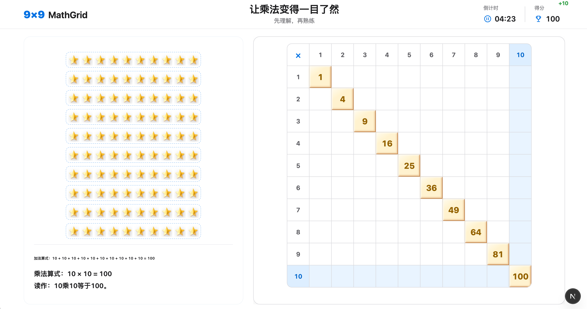

# 🧩 9x9 MathGrid (九九乘法数阵) - v1.1.0



> **基于前端全栈单兵工程规范 [Spec-Driven Solo (V1.2.5)](https://github.com/soyona/spec-driven-solo) 倾力打造的标杆实战项目。**
> 这是一个专门面向低年级儿童设计的 Apple 质感、全自适应乘法矩阵认知与闯关训练应用。全流程严格遵循“改码前先改图纸”的宪法约束，实现 100% 零瞎猜、零死锁的高确定性演进。

---

## 🚀 规范 V1.2.5 核心价值证明 (Case Study Value)

作为继 **[Hanzi Connect](https://github.com/soyona/hanzi-connect)** 之后的又一工业级实战样本，本项目完整验证了规范 **V1.2.5 版本** 针对智能体“状态漂移”与“网络视口边界”提出的多重锁死与物理防御机制：

1. **🔒 EST 物理交付卡点（No Log, No Done）**：在 M2 声光效果、关卡链路与 3D 自适应生态的敏捷腾挪中，智能体必须将物理更新 `memory-bank/activeContext.md` 与 `progress.md` 作为最终 Act 动作，彻底解决了智能体长对话下的马尔可夫认知退化。
2. **🌐 运行时网络边界审计（Runtime Auditing）**：针对 Next.js 应用在局域网（`192.168.1.2`）多端真机联调时，因热更新（HMR）安全策略导致的点击响应失效，项目前置在 `techContext.md` 中立项审计，通过顶层 `allowedDevOrigins` 配置锁死网络边界，抹平了“静态编译完美”与“用户运行时物理表现”的隐式死锁。
3. **📐 视口死锁与动态卡尺（Fluid Dynamic Scale）**：在 V1.2.5 升级中，面对 10×10 极端边界下点阵内容撑破视口的风险，项目通过弹性盒层级约束（`min-h-0 overflow-hidden`）结合动态行列缩放卡尺，彻底剥夺了中间图形区域向外无限制膨胀的能力，消除了物理滚动条。

---

## 🎨 产品核心特性与交互宪法

本项目在视觉、动效及状态机架构上，严密对齐了 Apple 风格的极简留白与平滑微动效设计：

* **🍎 高保真拟物化 3D 生态 (`ConceptVisualizer`)**：全面废除抽象的块体或微小行星。采用由深度径向渐变、多层线性折射高光打造的 **红富士苹果、饱满多汁橙、璀璨蓝宝石**，以及对角线平方数专属的 **3D 维度切面鎏金能量星**，为儿童提供极致直观的数感触觉体验。
* **⚡ 零延迟因果验证机制**：彻底移除对输入框 `onBlur` 失焦事件的延迟依赖。Zustand 状态机在 `onChange` 输入阶段进行受控数字的即时因果判定，用户输入正确答案的刹那，公式面板的呼吸胶囊瞬间炸开、直接呈现完整等式。
* **🎭 毛玻璃层正误动态反馈**：图形区完美加装了 Framer Motion 动效视窗。答对瞬间图形阵列整体触发带有 `spring` 弹性的向上趣味跳跃（Bounce）并伴随软绿色胜利光晕；输错提交则触发整体左右快速震颤的轻微摇头（Shake）与软红色微光警示。
* **🎵 原生 Web Audio 纯净实时合成**：摒弃任何外部巨型音频资产依赖，通过 Web Audio API 懒初始化共享 `AudioContext`，使用正弦波（Sine Wave）与指数级增益衰减（Gain Decay），纯代码实时合成答题正确的升调双音与通关渐进琶音。
* **📱 390px 窄屏动态视口自适应**：全局强锁定 `flex` 弹性流体网格与 `100dvh` 刚性防御围栏，在任何主流移动端或桌面分辨率下横纵向均无溢出包裹，多端真机交互体验保证 100% 完整单屏收容、零滚动条死锁。

---

## 📂 三轨制工程架构盘点

项目物理拓扑完全遵循 Spec-Driven 三轨职责隔离：

```text
9x9/
├── 📄 .clinerules / .codexrules    # ⚖️ 【最高铁律】常驻行为紧箍咒（含 3次报错编译熔断线）
├── 📂 product-assets/              # 🎨 【资产轨】人类初始 PRD 与产品多端响应式视觉蓝图
├── 📂 memory-bank/                 # 🧠 【记忆轨】V1.2.0 持久化大脑与运行环境边界控制中心
│   ├── 📄 techContext.md           # [🔒 已审计] 锁死 192.168.1.2 局域网开发安全源
│   └── 📄 dataModels.md            # 锁死 DifficultyTier, GameSettings, MatrixCell 强类型契约
└── 📂 src/                         # 🛠️ 【源码轨】Zustand 状态机与 Web Audio 纯代码物理落地
    ├── 📂 store/gameStore.ts       # 负责原子化难度切换、倒计时恢复及 mathgrid:effect 外部订阅
    └── 📂 utils/audio.ts           # 共享 AudioContext 原生低延迟波形合成器

```

---

## 🛠️ 技术栈与工程指标

* **核心框架**：Next.js 15 (App Router) + TypeScript 5 + Tailwind CSS v4
* **状态管理**：Zustand (全状态原子化原子重置机制)
* **动画系统**：Framer Motion (贝塞尔曲线与低饱和粒子)
* **工程指标**：
* `npm run lint` $\rightarrow$ **0 Errors / 0 Warnings**
* `npm run build` $\rightarrow$ **100% 静态预渲染 (Static Prerendered) 一次性通过**
* 本地配置轨已完全拦截 `.next/`、`out/` 与 `next-env.d.ts`，历史 commit 保持几百 KB 极致纯净度。


---

## 🚀 开发者 3 秒本地真机联调

如果你要在本地运行或让你的 AI 智能体介入该项目，请遵循以下标准 SOP：

1. **依赖克隆与安装**：
```bash
git clone git@github.com:soyona/9x9.git
cd 9x9
npm install

```


2. **运行局域网多端开发服务**：
```bash
npm run dev

```

3. **AI 智能体介入守则**：
直接使用 VS Code 打开根目录。由于根目录配置了 V1.2.0 的 `.clinerules`，你的 Cline / Codex 在读取本 `README.md` 和 `memory-bank/` 后，将自动继承无脑高频试错熔断机制。任何重构动作前，请提醒智能体首先更新 `memory-bank/activeContext.md`。
